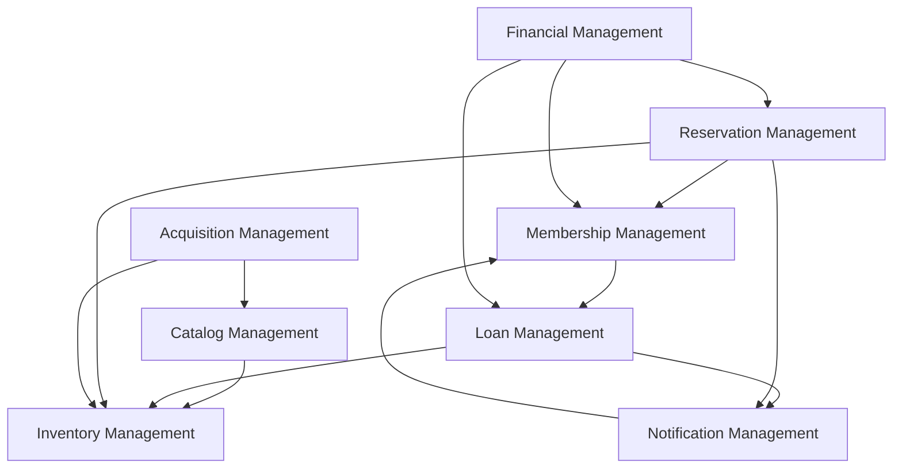
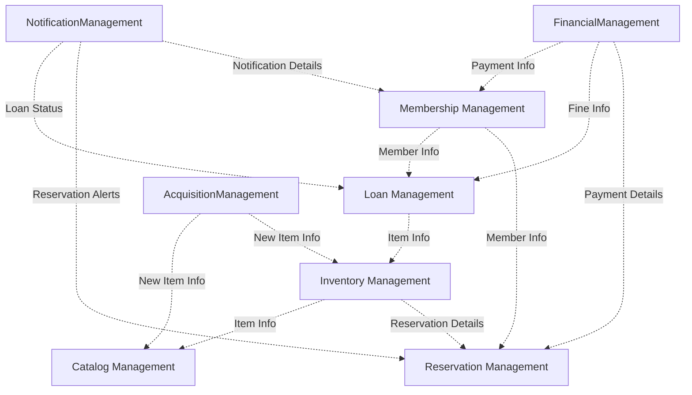

# Library Management System

## Contexts

```mermaid
graph TD
    CatalogManagement[Catalog Management]
    InventoryManagement[Inventory Management]
    MembershipManagement[Membership Management]
    LoanManagement[Loan Management]
    NotificationManagement[Notification Management]
    ReservationManagement[Reservation Management]
    AcquisitionManagement[Acquisition Management]
    FinancialManagement[Financial Management]
```

## Dependencies

```mermaid
graph TD
    CatalogManagement[Catalog Management] --> InventoryManagement[Inventory Management]
    MembershipManagement[Membership Management] --> LoanManagement[Loan Management]
    LoanManagement --> InventoryManagement
    LoanManagement --> NotificationManagement[Notification Management]
    ReservationManagement[Reservation Management] --> InventoryManagement
    ReservationManagement --> NotificationManagement
    ReservationManagement --> MembershipManagement
    NotificationManagement --> MembershipManagement
    AcquisitionManagement[Acquisition Management] --> CatalogManagement
    AcquisitionManagement --> InventoryManagement
    FinancialManagement[Financial Management] --> MembershipManagement
    FinancialManagement --> LoanManagement
    FinancialManagement --> ReservationManagement
```

## Data Flow (with sub-set of examples)

```mermaid
graph TD
    InventoryManagement -.-> |Item Info| CatalogManagement[Catalog Management]
    LoanManagement -.-> |Item Info| InventoryManagement[Inventory Management]
    MembershipManagement[Membership Management] -.-> |Member Info| LoanManagement 
    NotificationManagement -.-> |Loan Status| LoanManagement[Loan Management]
    InventoryManagement -.-> |Reservation Details| ReservationManagement[Reservation Management]
    NotificationManagement -.-> |Reservation Alerts| ReservationManagement[Reservation Management]
    MembershipManagement[Membership Management] -.-> |Member Info| ReservationManagement 
    NotificationManagement -.-> |Notification Details| MembershipManagement[Membership Management]
    AcquisitionManagement -.-> |New Item Info| CatalogManagement[Catalog Management]
    AcquisitionManagement -.-> |New Item Info| InventoryManagement[Inventory Management]
    FinancialManagement -.-> |Payment Info| MembershipManagement[Membership Management]
    FinancialManagement -.-> |Fine Info| LoanManagement[Loan Management]
    FinancialManagement -.-> |Payment Details| ReservationManagement[Reservation Management]

```
